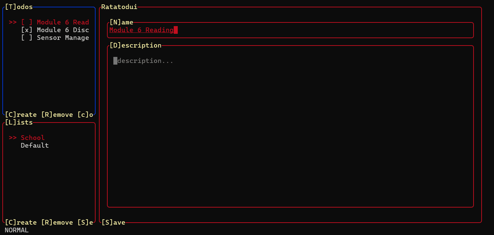
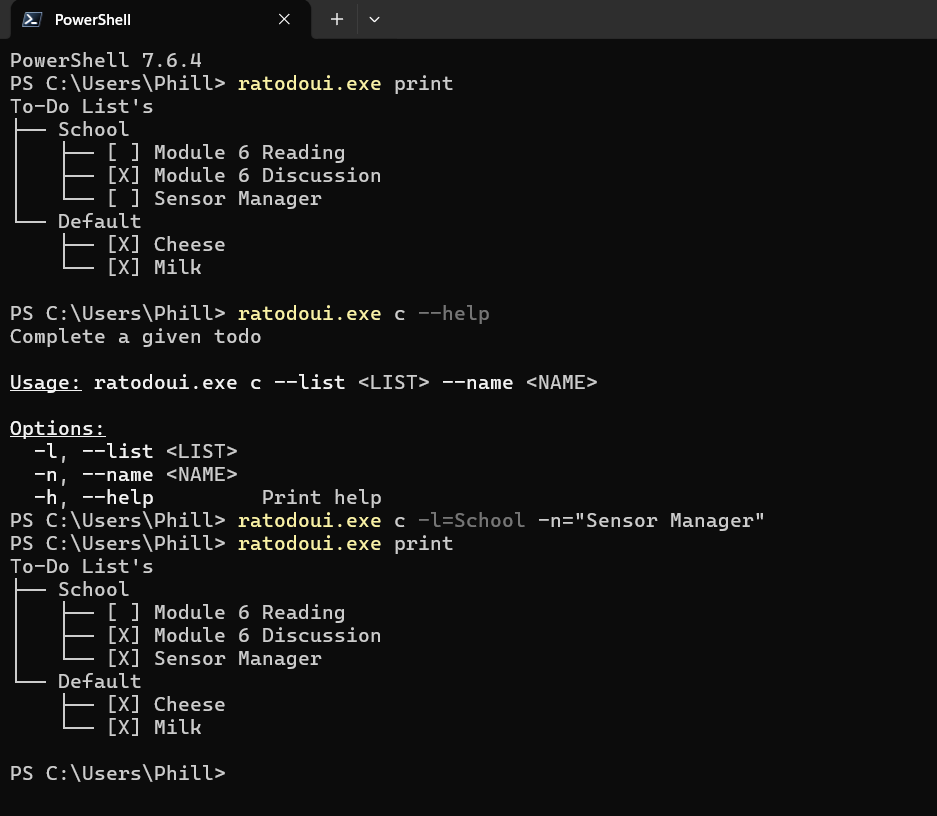

# Ratatodui

**Ratatodui** is a terminal-based To-Do application built with Rust and the [Ratatui](https://ratatui.rs) framework. It features Vim-like keybindings for seamless navigation across widgets, alongside a fast CLI interface for quick task management and scripting.



---

## Features & Usage

### Interactive TUI Mode
Launch the full interactive terminal application by running `ratatodui` with no subcommands. Use Vim-style keybindings (`h`, `j`, `k`, `l`) to navigate through lists and manage your tasks.

### Command Line Interface (CLI)
Built using `clap` for robust argument validation and auto-generated help menus, the CLI allows you to create, update, and delete lists or individual to-dos directly from your shell.

* **Tree Formatting:** The `print` subcommand renders your entire to-do hierarchy using a tree structure complete with completion status markers:



---

## Building from Source

### Prerequisites
* [Rust toolchain](https://www.rust-lang.org/tools/install) (`cargo`, `rustc`)

### Installation
1. Clone the repository:
   ```bash
   git clone [https://github.com/Phillip383/ratatodui.git](https://github.com/Phillip383/ratatodui.git)
   cd ratatodui